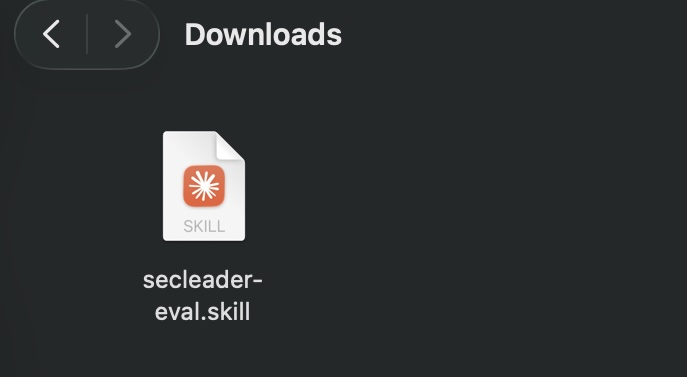
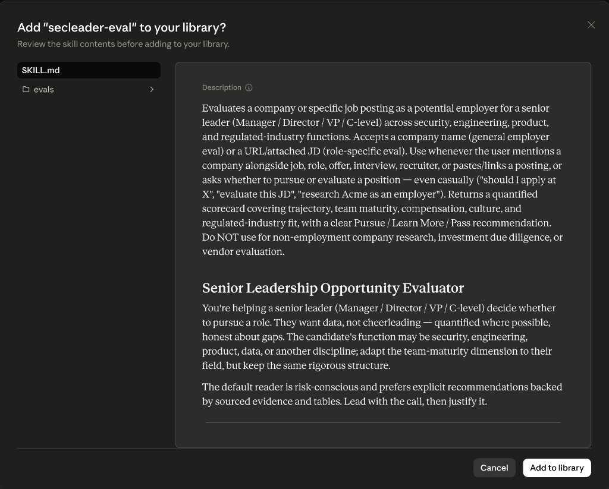
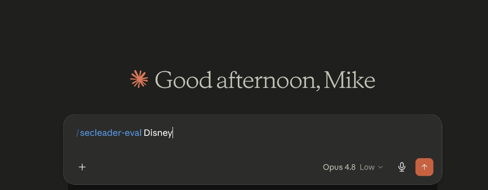
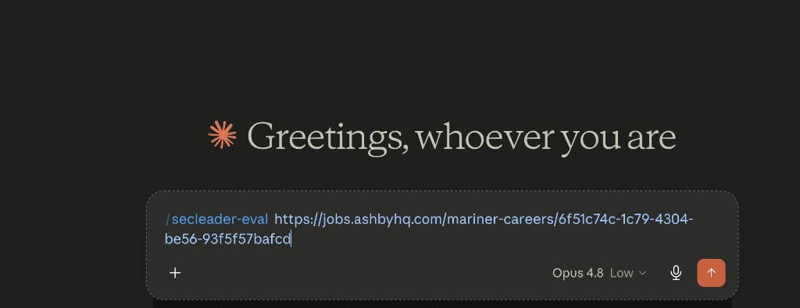
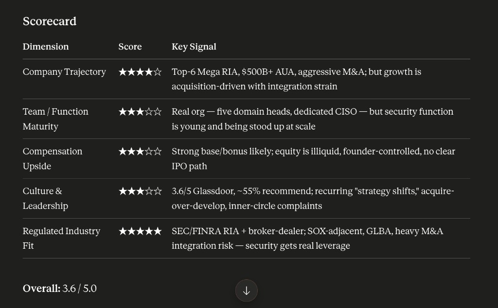

# secleader-eval — Senior Leadership Opportunity Evaluator

A Claude skill that evaluates companies and job postings for senior leaders (Manager / Director / VP / C-level) across security, engineering, product, and regulated-industry functions. It replaces subjective cheerleading with a data-driven scorecard, sourced narrative, and a clear **Pursue / Learn More / Pass** recommendation.

## What it does

When you invoke the skill, Claude researches the opportunity across five dimensions and returns:

- A **quantified scorecard** (5 dimensions, 1–5 stars each)
- A **narrative snapshot** covering company fundamentals, team maturity, compensation, culture, and regulatory context
- **Bonus-target and equity benchmarking** where data is available
- An explicit **Pursue**, **Learn More**, or **Pass** recommendation

## Input modes

The skill detects what you provide and adjusts scope automatically.

### Mode A — Company name only

Use when you want a general employer evaluation, not a specific posting.

**Example:** `/secleader-eval Disney`

Claude evaluates the company as a potential employer for a senior leader in your field. It searches for any currently posted leadership role to anchor role-specific fields (work type, employment terms, role type, comp band). If no relevant role is posted, those fields are marked unconfirmed and the evaluation proceeds as a general employer assessment rather than inventing a role.

### Mode B — Specific role (URL, pasted JD, or attachment)

Use when you have a particular job posting to evaluate.

**Examples:**

- `/secleader-eval https://jobs.ashbyhq.com/mariner-careers/6f51c74c-1c79-4304-be56-93f5f57bafcd`
- `/secleader-eval` with the full job description pasted or attached as a PDF

Claude reads the posting first and extracts the role title, responsibilities, work type, employment terms, comp range (if stated), and reporting line directly from the JD. It then researches the company around that specific role.

**Note:** Job-posting URLs on Ashby, Greenhouse, Lever, and Workday sometimes render as JavaScript and return only partial metadata. If that happens, Claude will flag missing fields (reporting line, exact comp, location/work type) and ask you to paste the full JD or attach a PDF before treating the evaluation as final.

## Installation

These steps assume you have never installed a Claude skill before.

### 1. Download the skill file

Go to [GitHub Releases](https://github.com/mikhaelf/secleader-eval/releases) and download `secleader-eval.skill`.



### 2. Upload to Claude

1. Open [Claude](https://claude.ai) and sign in.
2. Click your **profile menu** (bottom-left) → **Settings**.
3. Go to **Capabilities** → **Skills**.
4. Click **Upload skill** and select the `secleader-eval.skill` file you downloaded.

### 3. Add to your library

Claude shows a preview of the skill contents. Review them, then click **Add to library**.



The skill is now available in any Claude chat.

## Usage — Mode A (company name)

In a new chat, type the skill command followed by a company name:

```
/secleader-eval Disney
```

Send the message. Claude runs web research and returns the full opportunity report.



## Usage — Mode B (job URL or attachment)

In a new chat, type the skill command followed by a job-posting URL:

```
/secleader-eval https://jobs.ashbyhq.com/mariner-careers/6f51c74c-1c79-4304-be56-93f5f57bafcd
```

Alternatively, attach a PDF of the job description or paste the full JD text after the command. Claude evaluates that specific role at the company.



## Example output

The report opens with work arrangement details, then a scorecard across five dimensions:

| Dimension | What it measures |
| --- | --- |
| Company Trajectory | Funding, revenue, headcount, growth |
| Team / Function Maturity | Role type, team size, maturity signals, reporting line |
| Compensation Upside | Base, bonus targets, equity, market comparison |
| Culture & Leadership | Glassdoor/Blind sentiment, turnover, red flags |
| Regulated Industry Fit | HIPAA, SOX, FedRAMP, etc. and what they mean for your leverage |



Below the scorecard, the report includes narrative sections on company fundamentals, team and function, compensation (with bonus-target tables), culture, regulatory context, and a final **Pursue / Learn More / Pass** recommendation with sourced evidence.

## Evaluation framework

The skill researches each opportunity across five dimensions:

- **Company Fundamentals** — public/private status, HQ location, revenue, headcount, profitability, trajectory
- **Function & Team Maturity** — role type (operational leadership, deputy, field-advisory, or IC), top functional leader, team size, maturity signals, reporting structure
- **Compensation Signals** — base range, bonus targets by level, equity profile, total comp vs. market
- **Culture & Leadership Sentiment** — Glassdoor/Blind ratings, themes, executive turnover, layoff history
- **Regulated Industry Fit** — applicable compliance regimes and what they mean for budget and influence

Work arrangement (onsite, hybrid, remote) is reported as a neutral fact — not scored — so you can judge location fit yourself.

## License

MIT — see [LICENSE](LICENSE).
