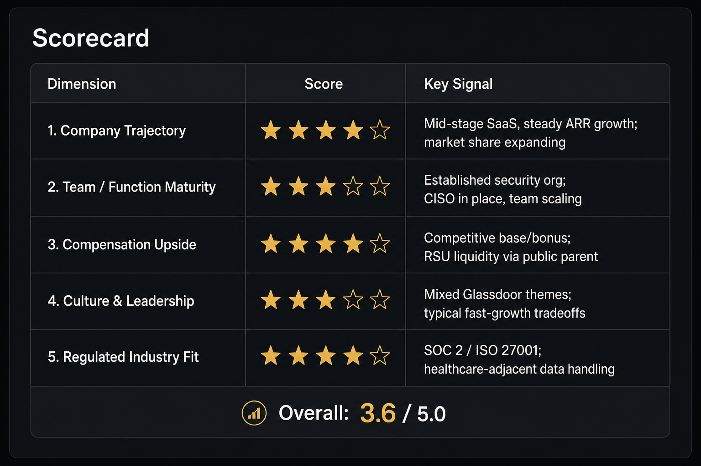

# secleader-eval — Senior Leadership Opportunity Evaluator

An agent skill for **Claude** and **Cursor** that evaluates companies and job postings for senior leaders (Manager / Director / VP / C-level) across security, engineering, product, and regulated-industry functions. It replaces subjective cheerleading with a data-driven scorecard, sourced narrative, and a clear **Pursue / Learn More / Pass** recommendation.

## What it does

When invoked, the agent researches the opportunity across five dimensions:

| Dimension | What it measures |
| --- | --- |
| Company Trajectory | Funding, revenue, headcount, growth |
| Team / Function Maturity | Role type, team size, maturity signals, reporting line |
| Compensation Upside | Base, bonus targets, equity, market comparison |
| Culture & Leadership | Glassdoor/Blind sentiment, turnover, red flags |
| Regulated Industry Fit | HIPAA, SOX, FedRAMP, etc. and your leverage |



Returns a quantified scorecard (1–5 stars per dimension), bonus-target tables where data exists, and an explicit recommendation with sources.

## Input modes

**Mode A — Company name** — general employer eval; anchors on a posted leadership role if one exists.

**Mode B — Specific role** — URL, pasted JD, or PDF attachment; role fields come from the posting.

Work arrangement (onsite / hybrid / remote) is reported as a neutral fact — not scored.

## Install

| Platform | Guide |
| --- | --- |
| **Claude Skills** | [docs/claude.md](docs/claude.md) — download `.skill` zip, upload or double-click |
| **Cursor Skills** | [docs/cursor.md](docs/cursor.md) — copy folder to `~/.cursor/skills/` or use `@secleader-eval` |

Build both packages from source:

```bash
./scripts/package-skill.sh
# dist/secleader-eval.skill       (Claude)
# dist/secleader-eval-cursor.zip  (Cursor)
```

## Repository layout

```
secleader-eval/           # installable skill folder (both platforms)
├── SKILL.md              # core workflow
├── cursor-workflow.md    # Cursor-only: browser JD fetch, parallel research
├── output-template.md    # report structure
├── scoring.md            # internal scoring rules
└── profile.example.md    # optional personal overrides → profile.md
docs/
├── claude.md             # Claude install & usage
├── cursor.md             # Cursor install & usage
└── images/               # screenshots
```

## Disclaimer

This skill is **not employment, legal, or financial advice**. Outputs are based on public sources and may be incomplete, outdated, or incorrect. Do not paste confidential recruiter communications or unpublished compensation details. Verify all findings independently. Respect third-party site terms of service (Glassdoor, Blind, LinkedIn, etc.).

Do not republish generated reports as factual statements about employers. For **your own** career decisions only — not for hiring, firing, or HR screening of others.

## License

MIT — see [LICENSE](LICENSE).
