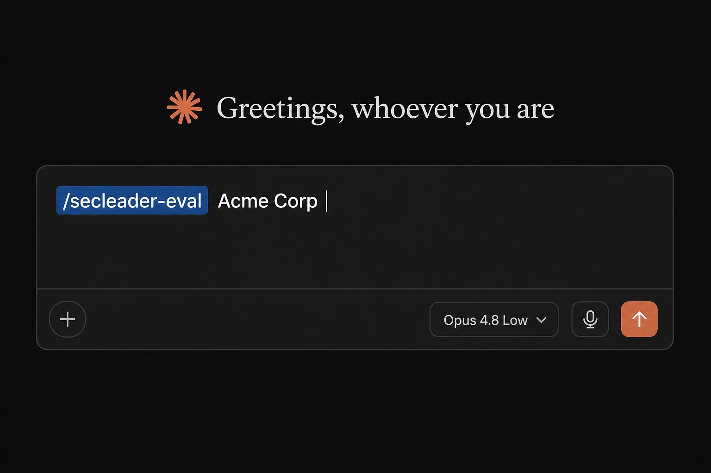
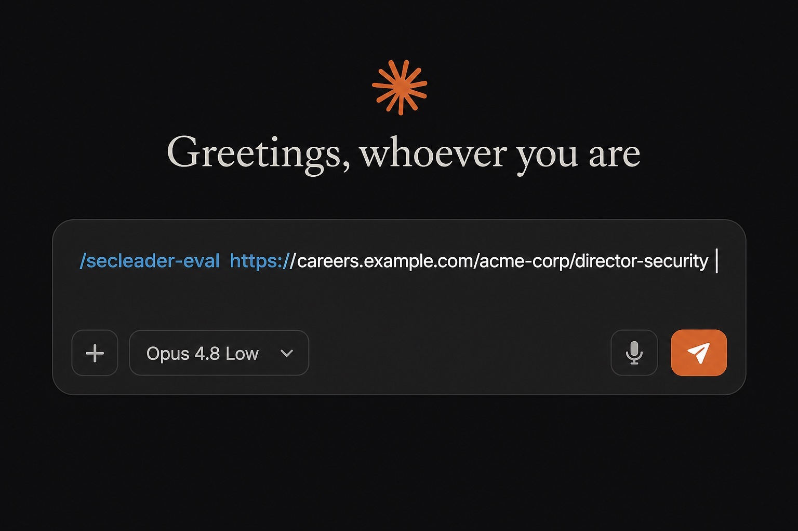

# Install & use — Claude Skills

## Download

Go to [GitHub Releases](https://github.com/mikhaelf/secleader-eval/releases) and download **`secleader-eval.skill`**.


Or build locally from the repo root:

```bash
./scripts/package-skill.sh
# → dist/secleader-eval.skill
```

## Install in Claude

**Option A — Mac (fastest)**

1. In Finder, locate `secleader-eval.skill` (usually in Downloads).
2. **Double-click** the file — Claude opens and starts the install flow.

**Option B — Upload via Claude web app**

1. Open [Claude](https://claude.ai) and sign in.
2. Sidebar → **Customize** → **Skills**.
3. Click **Upload skill** (or drag-and-drop `secleader-eval.skill`).

## Add to your library

Review the preview, then click **Add to library**.


## Usage

### Mode A — Company name

```
/secleader-eval Acme Corp
```



### Mode B — Job URL or attachment

```
/secleader-eval https://careers.example.com/acme-corp/director-security
```

Or paste the full JD / attach a PDF after the command.



**Note:** Ashby, Greenhouse, Lever, and Workday URLs may not fully render. If key fields are missing (reporting line, comp, location), paste the full JD before treating the eval as final.

## Privacy

When you use this skill, inputs are processed by [Claude / Anthropic](https://www.anthropic.com/privacy). This repository does not operate a backend or collect user data.
